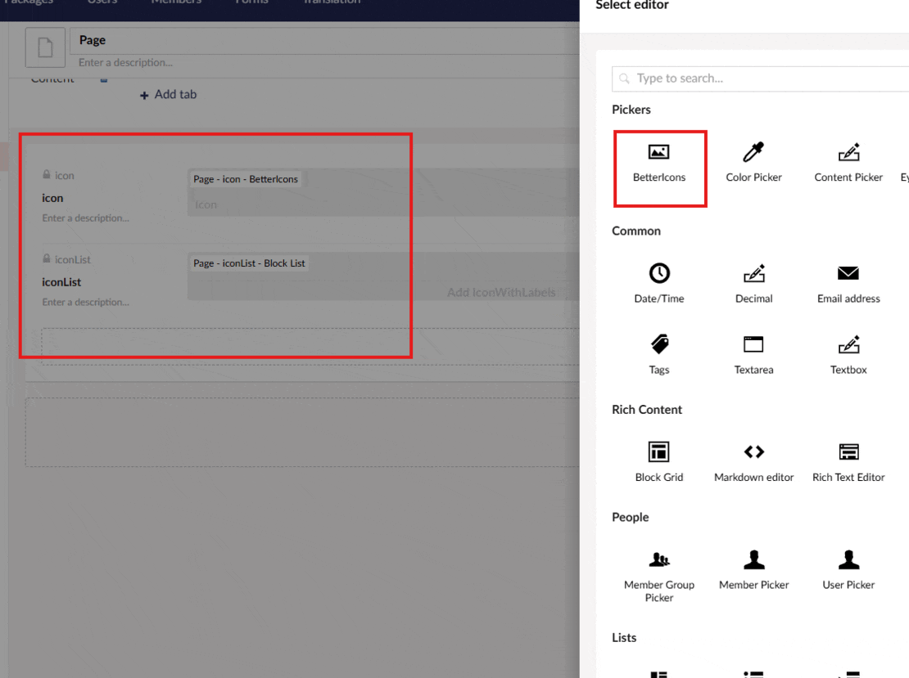

<div align="center">


# BetterIcons

[](https://www.nuget.org/packages/Umbraco.Community.BetterIcons/)
[](https://www.nuget.org/packages/Umbraco.Community.BetterIcons/)
[](https://github.com/niteshbabu/Umbraco.Community.BetterIcons/blob/main/LICENSE)
[](https://github.com/niteshbabu/Umbraco.Community.BetterIcons/issues)

[](https://marketplace.umbraco.com/)
[](https://umbraco.com)
[](https://dotnet.microsoft.com/)



**BetterIcons is a modern, powerful property editor for Umbraco CMS that provides access to 200,000+ icons from popular icon libraries. Built with React for a smooth, responsive user experience.**

</div>


## ✨ Features

- 🎨 **200,000+ Icons** - Access to Material Design Icons, Font Awesome, Bootstrap Icons, Heroicons, and 100+ more icon sets
- 🎯 **Smart Search** - Fast search across all collections with real-time results
- 🌈 **Color Customization** - Built-in color picker for each icon
- ⚡ **Performance Optimized** - Virtualized rendering for smooth scrolling through thousands of icons
- 🔧 **Zero Configuration** - Extension methods for easy Razor template usage, files bundled with DLL
- 📱 **Responsive UI** - Modern, touch-friendly interface
- 🔍 **Collection Browser** - Browse icons by collection with tab-based navigation
- ✅ **Visual Selection** - Currently selected icon is highlighted when reopening the picker
- 🚀 **CDN Delivery** - Icons loaded via Iconify CDN for optimal performance
- 📦 **No File Management** - Static web assets automatically served from the package

## 📦 Installation

Install via NuGet Package Manager:

```bash
dotnet add package Umbraco.Community.BetterIcons
```

Or via Package Manager Console:

```powershell
Install-Package Umbraco.Community.BetterIcons
```


## 🎯 Compatibility

| Umbraco Version | .NET Version | Package Version |
|----------------|--------------|------------------|
| 13.x           | .NET 8.0     | 1.x              |
| 12.x           | .NET 7.0     | 1.x              |
| 11.x           | .NET 7.0     | 1.x              |

- **Browser Support:** Modern browsers (Chrome, Firefox, Safari, Edge)

## 🚀 Quick Start

### 1. Create a Document Type Property

1. Go to **Settings > Document Types**
2. Add a new property to your document type
3. Select **BetterIcons** as the property editor
4. Save your document type

### 2. Use in Razor Templates

Add the required using statements at the top of your view:

```cshtml
@using BetterIcons.Extensions
@using BetterIcons.Models
```

Add the the script one time in your layout:

```cshtml
@BetterIconsValue.GetScript()
```

#### Simple Icon Rendering

```cshtml
@* Render icon with default size *@
@Model.RenderIcon("iconPropertyAlias")

@* Render icon with custom size *@
@Model.RenderIcon("iconPropertyAlias", size: 48)

@* Render icon with custom size and CSS class *@
@Model.RenderIcon("iconPropertyAlias", size: 64, cssClass: "my-icon")
```

#### Advanced Usage

```cshtml
@* Get the icon value object *@
@{
    var icon = Model.GetIconValue("iconPropertyAlias");
}

@if (!icon.IsEmpty)
{
    <div class="icon-container">
        @* Render with custom inline styles *@
        @Model.RenderIconWithStyle("iconPropertyAlias", "font-size: 64px; color: #ff0000;")
        
        @* Or render the icon value directly *@
        @icon.Render(size: 32)
        
        @* Access icon properties *@
        <p>Icon: @icon.Icon</p>
        <p>Color: @icon.Color</p>
    </div>
}
```

#### Complete Example

```cshtml
@using BetterIcons.Extensions
@using BetterIcons.Models

@{
    var icon = Model.GetIconValue("icon");
}

<!DOCTYPE html>
<html>
<head>
    <title>@Model.Name</title>
    @BetterIconsValue.GetScript()
</head>
<body>
    @if (!icon.IsEmpty)
    {
        <div class="hero">
            @icon.Render(size: 64, cssClass: "hero-icon")
            <h1>@Model.Value("title")</h1>
        </div>
    }
</body>
</html>
```


## 🎨 Icon Collections

The picker includes popular icon collections such as:

- **Material Design Icons** (mdi) - 7,000+ icons
- **Font Awesome** (fa, fa-brands, fa-solid) - 2,000+ icons
- **Bootstrap Icons** (bi) - 2,000+ icons
- **Heroicons** (heroicons) - 300+ icons
- **Feather** (feather) - 280+ icons
- **Lucide** (lucide) - 1,400+ icons
- **Tabler Icons** (tabler) - 4,800+ icons
- **Phosphor** (ph) - 9,000+ icons
- **Iconoir** (iconoir) - 1,500+ icons
- **Radix Icons** (radix-icons) - 300+ icons
- **Carbon** (carbon) - 2,000+ icons
- **Remix Icon** (ri) - 2,800+ icons

...and much more collections with 200,000+ total icons!

## ⚙️ Configuration

### Property Editor Settings

The BetterIcons property editor works out of the box with no configuration required. Simply add it to your document type and start using it.

### Customizing Icon Display

You can customize the appearance using CSS:

```css
.my-icon {
    width: 48px;
    height: 48px;
    color: #3544b1;
    transition: color 0.3s ease;
}

.my-icon:hover {
    color: #ff0000;
}
```

### Storing Values

Icon values are stored in the format: `collection:iconName|colorHex`

Example: `mdi:home|#3544b1`

This format is automatically handled by the extension methods and BetterIconsValue class.


## 🐛 Troubleshooting

### Icons Not Displaying

Make sure to include the Iconify script in your template:

```cshtml
@BetterIconsValue.GetScript()
```

This should be called once in your layout or page template, typically in the `<head>` section or before the closing `</body>` tag.

### Property Editor Not Appearing

If the BetterIcons property editor doesn't appear in the Umbraco backoffice:

1. Restart your Umbraco application
2. Clear your browser cache
3. Verify the package is installed: `dotnet list package | grep Umbraco.Community.BetterIcons`
4. Check that static web assets are enabled in your project

### Icons Not Showing Color

The color picker value is stored with the icon. If colors aren't displaying:

1. Ensure you're using the render methods provided (`Render()` or `RenderIcon()`)
2. Check that your CSS isn't overriding the icon color
3. Verify the stored value includes the color (e.g., `mdi:home|#3544b1`)

## 🤝 Contributing

Contributions are welcome! Please feel free to submit a Pull Request.


## 📞 Support

- **Issues:** [GitHub Issues](https://github.com/niteshbabu/Umbraco.Community.BetterIcons/issues)
- **Discussions:** [GitHub Discussions](https://github.com/niteshbabu/Umbraco.Community.BetterIcons/discussions)
---

**Made with ❤️ for the Umbraco Community**

If you find this package useful, please consider:
- ⭐ Starring the [GitHub repository](https://github.com/niteshbabu/Umbraco.Community.BetterIcons)
- 📢 Sharing it with other Umbraco developers
- 🐛 Reporting issues or suggesting features

